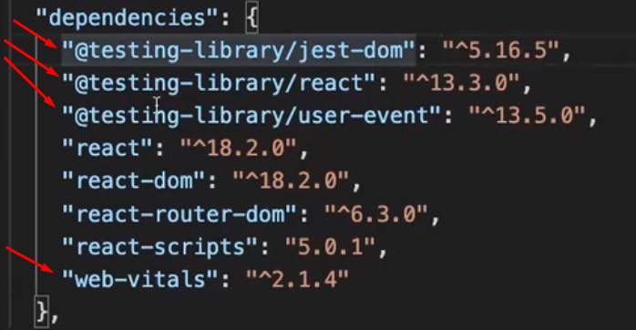

# Projeto Cookenu

## Processo de Desenvolvimento

-   [1. Resumo do Projeto](#1-resumo-do-projeto)
-   [2. Fluxograma de Telas](#2-fluxograma-de-telas)
-   [3. Wireframe de Telas](#3-wireframe-de-telas)
-   [4. API utilizada](#4-api-utilizada)
-   [5. Configurações: Create React App](#5-configurações-create-react-app)
-   [6. Organização de pastas](#6-organização-de-pastas)
-   [7. Roteamento](#7-roteamento)
-   [8. Styled Components](#8-styled-components)
-   [9. Chakra-UI](#9-chakra-ui)
-   [10. Constants](#10-constants)
-   [11. Header](#11-header)
-   [12. Página de Login](#12-página-de-login)
-   [13. Componentização](#13-componentização)
-   [14. Axios](#14-axios)
-   [15. Feed de Receitas](#15-feed-de-receitas)
-   [16. Adicionando receita](#16-adicionando-receita)
-   [17. Página de Detalhes](#17-página-de-detalhes)
-   [18. Logout e Proteção de Páginas](#18-logout-e-proteção-de-páginas)
-   [19. Hospedagem](#19-hospedagem)

## 1. Resumo do Projeto

Cookenu é um projeto proposto pela Labenu com o objetivo de revisar o módulo de React com integração de APIs, utilização de Design System e aplicação de Rotas.

-   A aplicação consiste em um site de receitas com as seguintes telas:
    -   Login;
    -   Cadastro;
    -   Lista de Receitas;
    -   Detalhes da Receita;
    -   Adicionar Receita;

## 2. Fluxograma de Telas


## 3. Wireframe de Telas

### Tela de Login:


### Tela de Cadastro:


### Tela de Lista de Receitas:


### Tela de Detalhes da Receita:


### Tela de Adicionar Receita:


## 4. API utilizada:

Clique [aqui](https://documenter.getpostman.com/view/21151478/2s8YzMZRju#intro) para ser direcionado para a documentação da API Cookenu utilizada no projeto.

## 5. Configurações: Create React App

-   Para criar um projeto React com CRA utilizei o comando:

    ```
    npx create-react-app cookenu
    ```

### O que pode remover após a criação do projeto react:

-   Dentro da pasta `cookenu`:

    

-   Dentro de `src`:<br>
    

-   Em `App.js`, excluir as importações e limpar conteúdo:
    

    

-   No `index.js` presente dentro da `src`, limpar importações:
    
    

-   Em `package.json` excluir as bibliotecas que não estão mais sendo usadas:
    

## 6. Organização de pastas

-   Dentro de `src` criei uma pasta `pages`, e cada página tem sua pasta e um arquivo `index.js`.
    

-   Importante notar que `pages` possui seu próprio arquivo `index.js`, utilizado para fazer importações em um só lugar:<br>
    

    -   O arquivo `index.js` de `pages` possui a seguinte estrutura:

        ```
        export * from './add-recipe';
        export * from './feed';
        export * from './login';
        export * from './recipe-detail';
        export * from './signup';
        ```

    -   Dessa forma quando eu chamar qualquer página, posso refenciar o `index.js` de `pages`:
        ```
        import {
            LoginPage,
            SignupPage,
            FeedPage,
            RecipeDetailPage,
            AddRecipePage,
        } from '../pages';
        ```

## 7. Roteamento

-   Como o react router é uma biblioteca, precisamos fazer a instalação com o seguinte comando:

    ```
    npm install react-router-dom
    ```

-   Dentro da `src` criei uma pasta chamada `routes` e dentro dela um arquivo chamado `router.js`, dentro desse arquivo o seguinte código:

    ```
    import { BrowserRouter, Routes, Route } from 'react-router-dom';
    import {
        LoginPage,
        SignupPage,
        FeedPage,
        RecipeDetailPage,
        AddRecipePage,
    } from '../pages';

    export const Router = () => {
        return (
            <BrowserRouter>
                <Routes>
                    <Route path="/add-recipe" element={<AddRecipePage />} />
                    <Route path="/feed" element={<FeedPage />} />
                    <Route path="/login" element={<LoginPage />} />
                    <Route path="/recipe/:id" element={<RecipeDetailPage />} />
                    <Route path="/signup" element={<SignupPage />} />
                </Routes>
            </BrowserRouter>
        );
    };
    ```

-   Com as rotas criadas, é necessário chama-la no `App.js` da seguinte forma:

    ```
    import { Router } from './routes';

    const App = () => {
        return (
            <Router />
        );
    };

    export default App;
    ```

    -   A partir desse momento é possível testar as rotas mudando a URL e verificar se o que tem em cada página está aparecendo de forma correta.

-   Ainda dentro da pasta `routes`, criei um arquivo chamado `coordinator.js` responsável por armazenar as funções que irão fazer a troca de páginas, segue o código do `coordinator.js`:

    ```
    export const goToLoginPage = (navigator) => {
        navigator('/login');
    };

    export const goToSignupPage = (navigator) => {
        navigator('/signup');
    };

    export const goToFeedPage = (navigator) => {
        navigator('/feed');
    };

    export const goToRecipeDetailPage = (navigator, id) => {
        navigator(`/recipe/${id}`);
    };

    export const goToAddRecipePage = (navigator) => {
        navigator('/add-recipe');
    };
    ```

## 8. Styled Components

### Instalação:

```
npm install styled-components@latest
```

## 9. Chakra-UI

### Instalação:

```
npm i @chakra-ui/react @emotion/react @emotion/styled framer-motion
```

### Setup do `chakra-ui`:

Em `App.js` importei o `ChakraProvider` e englobei todo meu conteúdo com ele:

```
(...)
import { ChakraProvider } from '@chakra-ui/react'
(...)
const App = () => {
    return (
        <ChakraProvider>
            <Router />
        </ChakraProvider>
    );
};
(...)
```

### Utilizando Theme

Para utilizar os temas do `chakra-ui`, dentro de `src` criei uma pasta chamada `styles`. E dentro dessa pasta um arquivo chamado `index.js` e um arquivo chamado `theme.js`

-   Conteúdo do `index.js`:

    ```
    export * from './theme';
    ```

-   Para customizar o tema verifiquei nessa [documentação](https://chakra-ui.com/docs/styled-system/customize-theme) o procedimento:

    ```
    // 1. Import `extendTheme`
    import { extendTheme } from "@chakra-ui/react"

    // 2. Call `extendTheme` and pass your custom values
    const theme = extendTheme({
    colors: {
        brand: {
        100: "#f7fafc",
        // ...
        900: "#1a202c",
        },
    },
    })

    // 3. Pass the new theme to `ChakraProvider`
    <ChakraProvider theme={theme}>
    <App />
    </ChakraProvider>

    // 4. Now you can use these colors in your components
    function Usage() {
    return <Box bg="brand.100">Welcome</Box>
    }
    ```

-   Conteúdo de `theme.js`:

    ```
    import { extendTheme } from '@chakra-ui/react';

    export const theme = extendTheme({
        // colors: {
        //     brand: {
        //         100: '#f7fafc',
        //         // ...
        //         900: '#1a202c',
        //     },
        // },
    });
    ```

-   Passei o tema para o provider dessa forma:

    ```
    (...)
    import { theme } from './styles';
    const App = () => {
        return (
            <ChakraProvider theme={theme}>
                <Router />
            </ChakraProvider>
        );
    };
    (...)
    ```

## 10. Constants

Dentro de `src` criar uma pasta chamada `constants` e dentro dela um arquivo chamado `index.js`, o arquivo mencionado possui o seguinte código:

```
export const BASE_URL = 'https://api-cookenu.onrender.com';
```

## 11. Header

### Chamado do Header

Como o `Header` é comum em todas as páginas, por isso irei colocar o Header dentro de `router.js` para que o código não seja repetido. Porque coisas que não são dependentes de rotas mas estiverem **dentro** de `<BrowserRouter>` serão renderizadas _sempre_!

Por isso o `Header` será chamado aqui:


### Criação do Header

Em `src` criei uma pasta `components` que vai armazenar os componentes comum da aplicação, ou seja, componentes que não dependerem de uma página só e sim serão divididos entre todos.

Dentro de `components` criei um `index.js` e uma pasta para cada componente

No `index.js` de `components` tenho a seguinte exportação:

```
export * from './header';
```

E em `header` irei criar o componente normalmente e depois importar no `Router`

Código do `index.js` de `header`:

```
import { HeaderStyled } from './styled';
import { Button } from '@chakra-ui/react';

export const Header = () => {
    return (
        <HeaderStyled>
            <Button variant="header">Cookenu</Button>
            <Button variant="header">Login</Button>
        </HeaderStyled>
    );
};
```

Código do `styled.js` de `header`:

```
import styled from 'styled-components';
import { theme } from '../../styles/theme';

export const HeaderStyled = styled.div`
    height: 10vh;
    width: 100vw;
    display: flex;
    flex-direction: row;
    justify-content: space-between;
    align-items: center;
    background-color: ${theme.colors.laranja['500']};
`;
```

### Configurações do `theme.js` da pasta `styles` que foi utilizada no `Header`:

```
import { extendTheme } from '@chakra-ui/react';

export const theme = extendTheme({
    components: {
        Button: {
            variants: {
                header: {
                    _hover: {
                        bg: 'yellow.500',
                        transition: 'bg 0.3s ease-in-out',
                    },
                },
            },
        },
    },
    colors: {
        laranja: {
            500: '#FE7E02',
        },
        yellow: {
            500: '#f9b24e',
        },
    },
});
```

## 12. Página de Login

-   Realizei alguns ajustes na estilização para o formulário:

    -   Em `theme.js`, criei outras `variants`, uma chamada `form` e outra chamada `logo`:

    ```
    (...)
    form: {
            bg: 'yellow.500',
            width: '100%',
            _hover: {
                bg: 'laranja.500',
                transition: 'bg 0.3s ease-in-out',
            },
        },
    logo: {
            bg: 'none',
            _hover: {
                bg: 'none',
            },
        },
    (...)
    ```

-   Também criei componentes de estilização através do `styled-components` para utilizar no form:

    ```
    import styled from 'styled-components';

    export const LoginPageContainer = styled.div`
        height: 90vh;
        width: 100vw;
        display: flex;
        justify-content: center;
        align-items: center;
        background-color: lightgrey;
    `;

    export const FormContainer = styled.div`
        width: 40vw;
        display: flex;
        flex-direction: column;
        justify-content: space-between;
        background-color: white;
        border-radius: 10px;
        padding: 10px;
        input, p {
            margin-bottom: 10px;
        }
    `;
    ```

-   Utilizei o hook `useForm` para fazer o controle dos inputs:

    ```
    import { useState } from 'react';

    export const useForm = (initialState) => {
        const [form, setForm] = useState(initialState);

        const onChangeInputs = (event) => {
            const { name, value } = event.target;
            setForm({ ...form, [name]: value });
        };

        const clearInputs = () => {
            setForm(initialState);
        };

        return [form, onChangeInputs, clearInputs];
    };
    ```

-   Por fim, importei formulários do `Chakra-UI` e o adaptei para a minha necessidade.

    ```
    const [form, onChangeInputs, clearInputs] = useForm({
            email: '',
            senha: '',
        });

        const [isEmailValid, setIsEmailValid] = useState(true);
        const [isPasswordValid, setIsPasswordValid] = useState(true);
        const [messageEmail, setMessageEmail] = useState('');
        const [messagePassword, setMessagePassword] = useState('');

        useEffect(() => {
            if (form.email || form.senha) {
                if (form.senha === '') {
                    setIsEmailValid(
                        /[a-zA-Z0-9]+@[a-z]{3}[.a-z]?/.test(form.email)
                    );
                    setMessageEmail('Por favor, digite um e-mail válido');
                }
                if (form.senha !== '') {
                    setIsPasswordValid(
                        /^(?=.*[a-z])(?=.*[A-Z])(?=.*\d)(?=.*[@#$%^&+=])(?!.*\s).{8,}$/.test(
                            form.senha
                        )
                    );
                    setMessagePassword(
                        'Sua senha precisa de ao menos uma letra maiúscula, uma letra minúscula, um caracter especial e um número.'
                    );
                }
            }
        }, [form.email, form.senha]);

        const [show, setShow] = useState(false);
        const handleClick = () => setShow(!show);

        const onSubmit = (e) => {
            e.preventDefault();
            console.log(form);

            setIsEmailValid(/[a-zA-Z0-9]+@[a-z]{3}[.a-z]?/.test(form.email));
            setMessageEmail('Por favor, digite um e-mail válido');
            setIsPasswordValid(
                /^(?=.*[a-z])(?=.*[A-Z])(?=.*\d)(?=.*[@#$%^&+=])(?!.*\s).{8,}$/.test(
                    form.senha
                )
            );
            setMessagePassword(
                'Sua senha precisa de ao menos uma letra maiúscula, uma letra minúscula, um caracter especial e um número.'
            );
            if (isEmailValid === true && isPasswordValid === true) {
                clearInputs();
            }
        };
    ```

-   Além disso utilizei a biblioteca [React Icons](https://react-icons.github.io/react-icons/icons?name=fa):
    -   Para instalar:
    ```
    https://react-icons.github.io/react-icons/
    ```
    -   Depois importantei o nome do componente e utilizei na visualização da senha:
    ```
    import { IconName } from "react-icons/fa";
    ```

## 13. Componentização

-   Reestruturei algumas partes do projeto em componentes, como:

    -   inputs:
        -   inputs de email
        -   inputs de nome
        -   inputs de senha

-   Depois chamei cada componente em sua respectiva página e passei os valores que eram digitados pelo usuário através de props

-   Também passei as funções de regex para dentro da pastaas `constants` e chamei nas páginas quando necessário

## 14. Axios

Para utilizar o `axios` é preciso instalar:

```
npm i axios
```

Em `constants` criei as funções que fazem as requisições:

```
// REQUESTS API COOKENU:
export const BASE_URL = 'https://api-cookenu.onrender.com';

export const Login = async (body) => {
    const { data } = await axios.post(`${BASE_URL}/user/login`, body);
    return data;
};

export const Signup = async (body) => {
    const { data } = await axios.post(`${BASE_URL}/user/signup`, body);
    return data;
};
// -----------------
```

Transformei a função de `onSubmit` da página de login e da página de cadastro em funções assíncronas e fiz as requisições passandoa s informações fornecidas pelo usuário:

### Login

```
    const onSubmit = async (e) => {
        e.preventDefault();
        console.log(form);
        setIsEmailValid(validateEmail(form.email));
        setIsPasswordValid(validatePassword(form.senha));
        if (isEmailValid === true && isPasswordValid === true) {
            clearInputs();
        }
        try {
            const { token } =
                isEmailValid &&
                isPasswordValid &&
                (await Login({
                    email: form.email,
                    password: form.senha,
                }));
            localStorage.setItem('cookenu.token', token);
            goToFeedPage(navigator);
        } catch (e) {
            console.log(e.response.data.message);
        }
    };
```

### Signup

```
    const onSubmit = async (e) => {
        e.preventDefault();
        console.log(form);
        setIsEmailValid(validateEmail(form.email));
        setIsPasswordValid(validatePassword(form.senha));
        setIsNameValid(validateName(form.name));
        if (isEmailValid === true && isPasswordValid === true) {
            clearInputs();
        }
        try {
            const { token } =
                isNameValid &&
                isEmailValid &&
                isPasswordValid &&
                (await Signup({
                    name: form.name,
                    email: form.email,
                    password: form.senha,
                }));
            localStorage.setItem('cookenu.token', token);
            goToFeedPage(navigator);
        } catch (e) {
            alert(e.response.data.message);
        }
    };
```

## 15. Feed de Receitas

Em `constants` adicionei uma função para pegar todas as receitas:

```
export const ListRecipes = async () => {
    const { data } = await axios.get(`${BASE_URL}/recipe/all`, {
        headers: {
            Authorization: localStorage.getItem('cookenu.token'),
        },
    });
    return data;
};
```

Em seguida reestruturei a página de feed, importando a função que faz a requisição no momento em que essa página é carregada:

```
import { useEffect, useState } from 'react';
import { FeedContainerStyled, ImgRecipe, RecipeCardStyled } from './style';
import { ListRecipes } from '../../constants';
import { useNavigate } from 'react-router-dom';
import { goToRecipeDetailPage } from '../../routes/coordinator';
import { Button } from '@chakra-ui/react';

export const FeedPage = () => {
    const navigator = useNavigate();
    const [recipes, setRecipes] = useState([]);

    useEffect(() => {
        ListRecipes()
            .then((data) => {
                setRecipes(data);
            })
            .catch((e) => {
                console.log(e);
            });
    }, []);

    return (
        <FeedContainerStyled>
            {recipes.slice(0, 9).map((recipe, i) => (
                <RecipeCardStyled
                    onClick={() => {
                        goToRecipeDetailPage(navigator, recipe.id);
                    }}
                    key={i}
                >
                    <ImgRecipe
                        alt="imagem da receita"
                        src={recipe.imageUrl}
                        onError={(e) => {
                            e.target.onerror = null;
                            e.target.src = `https://picsum.photos/seed/${i}/200/200`;
                        }}
                    />
                    <h3>{recipe.title}</h3>
                </RecipeCardStyled>
            ))}
            <Button variant="add">+</Button>
        </FeedContainerStyled>
    );
};
```

-   Criei mais uma variante no `theme`:

    ```
    (...)
    add: {
        bg: 'laranja.500',
        borderRadius: '50%',
        fontSize: '4vh',
        width: '3vw',
        p: '3vh',
        position: 'fixed',
        bottom: '3vh',
        right: '2vh',
        _hover: {
            transform: 'scale(1.05)',
            transition: '0.5s',
        },
    },
    (...)
    ```

-   E uma estilização para o feed:

    ```
    import styled from 'styled-components';

    export const FeedContainerStyled = styled.div`
        display: grid;
        grid-template-columns: 1fr 1fr 1fr;
        width: 80vw;
        justify-items: center;
        grid-gap: 2vh 0;
        padding: 2vh;
        justify-content: center;
        align-items: center;
        margin: 0 auto;
    `;

    export const RecipeCardStyled = styled.div`
        border: 2px solid black;
        width: 20vw;
        transition: 0.5s;
        &:hover {
            transform: scale(1.05);
            cursor: pointer;
        }
    `;

    export const ImgRecipe = styled.img`
        padding: 1vh;
        height: 25vh;
        border-radius: 10px;
    `;
    ```

Observações importantes da página de feed:

-   Entender o processo
    1. Criar a função que faz a requisição
    2. Chamar esta função na página onde será usada
    3. Passar o resultado dessa requisição para um estado
    4. Renderizar esse estado em um map no return

## 16. Adicionando receita

Adicionei a rota no btn de `+`:

```
<Button
    variant="add"
    onClick={() => {
        goToAddRecipePage(navigator);
    }}
>
    +
</Button>
```

Em `constants` criei a requisição para a página de Adicionar Receitas

```
export const AddRecipe = async (body) => {
    const { data } = await axios.post(`${BASE_URL}/recipe`, body, {
        headers: {
            Authorization: localStorage.getItem('cookenu.token'),
        },
    });
    return data;
};
```

Ainda no mesmo arquivo, criei validações para os próximos inputs:

```
export const validateTitle = (title) => /.{3,}/.test(title);

export const validateUrl = (url) => /https[s]?:\/\/[a-zA-Z]+.com/.test(url);
```

Na pasta de components > inputs. Criei mais inputs para `title`, `description` e `image`

Montei a página de `Adicionar Receitas` da seguinte forma:

```
import { useEffect, useState } from 'react';
import { useForm } from '../../hooks';
import {
    CenteredPageContainer,
    FormContainer,
    DescriptionTextarea,
    ImageInput,
    TitleInput,
} from '../../components';

import { Button, Center, FormLabel } from '@chakra-ui/react';
import { AddRecipe, validateTitle, validateUrl } from '../../constants';
import { goToFeedPage } from '../../routes/coordinator';
import { useNavigate } from 'react-router-dom';

export const AddRecipePage = () => {
    const [form, onChangeInputs, clearInputs] = useForm({
        description: '',
        title: '',
        image: '',
    });

    const [isTitleValid, setIsTitleValid] = useState(true);
    const [isUrlValid, setIsUrlValid] = useState(true);

    const navigator = useNavigate();

    useEffect(() => {
        if (form.title) {
            setIsTitleValid(validateTitle(form.title));
        }
    }, [form.title]);

    useEffect(() => {
        if (form.image) {
            setIsUrlValid(validateUrl(form.image));
        }
    }, [form.image]);

    const onSubmit = async (e) => {
        e.preventDefault();
        try {
            if (isUrlValid && isTitleValid) {
                await AddRecipe({
                    title: form.title,
                    description: form.description,
                    imageUrl: form.image,
                });
                alert('Receita cadastrada com sucesso!');
                clearInputs();
                goToFeedPage(navigator);
            }
        } catch (e) {
            alert(e.response.data.message);
        }
    };

    return (
        <CenteredPageContainer>
            <FormContainer>
                <form onSubmit={onSubmit}>
                    <Center>
                        <FormLabel
                            fontFamily="Lobster, cursive"
                            fontSize="1.8em"
                            color="cinza.500"
                            direction="collumn"
                        >
                            Adicionar Nova Receita
                        </FormLabel>
                    </Center>
                    <TitleInput
                        value={form.title}
                        onChange={onChangeInputs}
                        isValid={isTitleValid}
                    />
                    <DescriptionTextarea
                        value={form.description}
                        onChange={onChangeInputs}
                        isValid={true}
                    />
                    <ImageInput
                        value={form.image}
                        onChange={onChangeInputs}
                        isValid={isUrlValid}
                    />
                    <Button color="cinza.500" type="submit" variant="form">
                        Adicionar
                    </Button>
                </form>
            </FormContainer>
        </CenteredPageContainer>
    );
};
```

## 17. Página de Detalhes

Em `constants` criei a função que faz a requisição dos detalhes da receita:

```
export const GetRecipe = async (id) => {
    const { data } = await axios.get(`${BASE_URL}/recipe/${id}`, {
        headers: {
            Authorization: localStorage.getItem('cookenu.token'),
        },
    });
    return data;
};
```

Fiz a chamada da requisição na página de detalhes:

```
import { useEffect, useState } from 'react';
import { useParams } from 'react-router-dom';
import { GetRecipe } from '../../constants';

export const RecipeDetailPage = () => {
    const { id } = useParams();
    console.log('id url', id);

    const [recipe, setRecipe] = useState();

    useEffect(() => {
        GetRecipe(id)
            .then((recipe) => {
                setRecipe(recipe[0]);
            })
            .catch((e) => console.log(e.response.data.message));
    }, []);

    return !recipe ? (
        <h1>Não há receitas com esse id</h1>
    ) : (
        <>
            
            <h1>{recipe.title}</h1>
            <p>{recipe.description}</p>
        </>
    );
};
```

## 18. Logout e Proteção de Páginas

### Logout

Para a lógica de Login e Logout:

-   Criei estados nas rotas, que no momento é o pai em comum de todos. Passei por props esses estados para os componentes Login e Header

```
    (...)
    const [isLoggedIn, setIsLoggedIn] = useState(false);
    (...)
    <Header isLoggedIn={isLoggedIn} setIsLoggedIn={setIsLoggedIn} />
    (...)
    <Route path="/login" element={
    <LoginPage isLoggedIn={isLoggedIn} setIsLoggedIn={setIsLoggedIn}/>}/>
    (...)
```

Chamei as props em `Header`

```
(...)
export const Header = ({ isLoggedIn, setIsLoggedIn }) => {
(...)
```

Ainda em `Header` estabeleci a lógica:

```
(...)
const buttonAction = () => {
    if (isLoggedIn) {
        localStorage.removeItem('cookenu.token');
        setIsLoggedIn(false);
    }
    goToLoginPage(navigator);
};


(...)

const [buttonText, setButtonText] = useState(
    isLoggedIn ? 'Logout' : 'Login'
);

(...)

useEffect(() => {
    const token = localStorage.getItem('cookenu.token');
    if (!token) {
        setButtonText('Login');
    } else {
        setButtonText('Logout');
    }
}, [isLoggedIn]);
(...)
```

Chamei a função com a lógica e a const que muda o texto no Button do `Header`

```
<Button
    onClick={() => {
        buttonAction();
    }}
    p="5vh"
    fontSize="3vh"
    color="cinza.500"
    variant="link"
    _hover={{
        textDecoration: 'underline',
    }}
>
    {buttonText}
</Button>
```

Agora em `Login`, recebi a prop que seta o estado:

```
(...)
export const LoginPage = ({ setIsLoggedIn }) => {
(...)
```

E estabeleci que após o Submit bem sucedido eu iria setar o valor de isLogoggedIn:

```
    (...)
    const onSubmit = async (e) => {
    (...)
        setIsLoggedIn(true);
        goToFeedPage(navigator);
    } catch (e) {
        console.log(e.response.data.message);
    }
    (...)
```

### Proteção de Páginas

Para proteger as páginas de usuários não logados, criei o seguinte custom hook:

```
import { useEffect } from 'react';
import { goToLoginPage } from '../routes/coordinator';

export const useProtectPage = (navigator) => {
    useEffect(() => {
        const token = localStorage.getItem('cookenu.token');
        if (!token) {
            goToLoginPage(navigator);
        }
    }, [navigator]);
};
```

Importei esse hook na página de `feed` e `adicionar receita`

## 19. Hospedagem

Decidi hospedar o projeto este projeto na plataforma [Vercel](https://vercel.com/)

### Procedimento:

1. Criei um conta na [Vercel](https://vercel.com/) e fiz login pelo Github;

2. No meu repositório local instalei a Vercel globalmente com o seguinte comando:

    ```
    npm install -g vercel
    ```

3. Existem duas possibilidades de implementação, escolhi fazer pela _Interface da Vercel_ da seguinte forma:
    - Na página inicial da Vercel, clique no botão "Import Project".
    - Selecione a pasta do seu projeto React.
    - Clique em "Deploy" para implantar o projeto.
